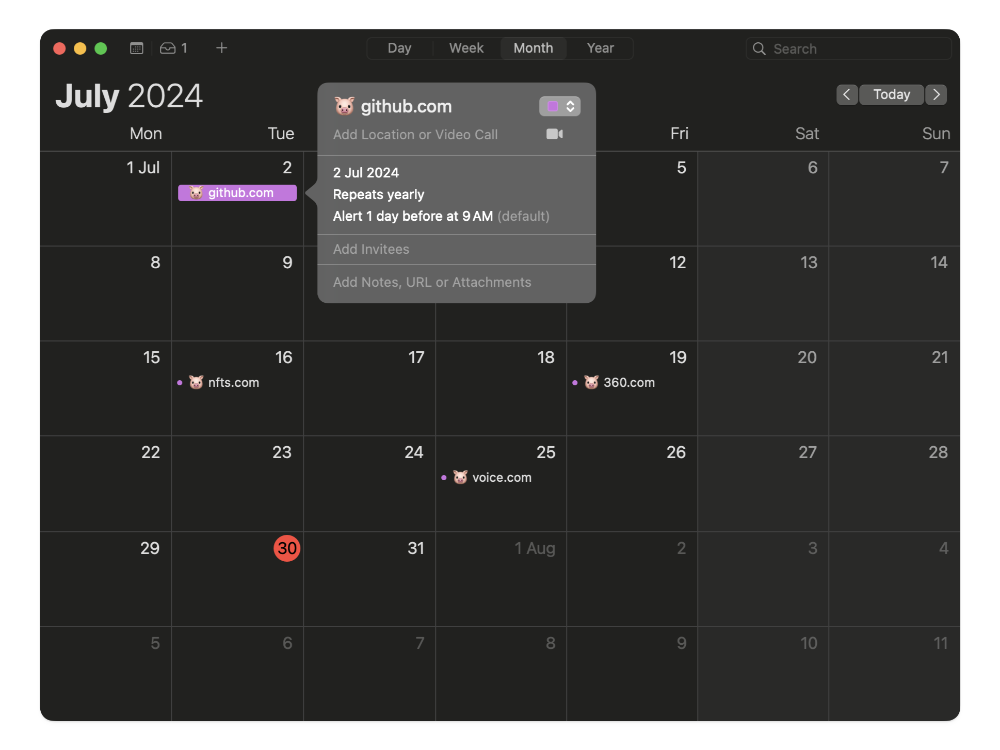
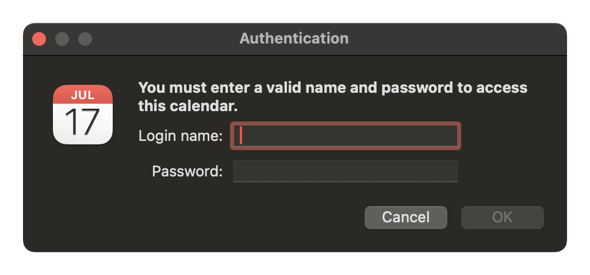
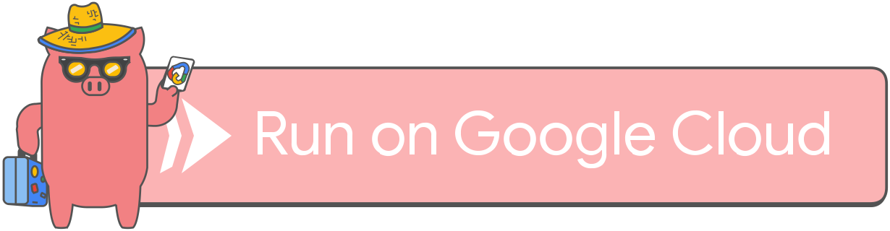

# Porkbun iCal

*A calendar service for your Porkbun domains.*


---

Each domain's respective renewal/expiry date will be added to your calendar as an event. Here's what it looks like in the Calendar app on macOS:



## Usage

Once deployed, subscribe to your calendar by visiting `https://your-service-url/calendar.ics`.

The service uses Porkbun's API to fetch details of your domains. You can provide your API credentials in one of two ways:

1. Environment variables deployed with the service.
2. HTTP Basic Auth per request.

### 1. Environment variables

| Parameter            | Value              |
| -------------------- | ------------------ |
| PORKBUN_API_KEY      | Porkbun API key    |
| PORKBUN_API_SECRET   | Porkbun API secret |

### 2. HTTP Basic Auth

| Parameter  | Value              |
| ---------- | ------------------ |
| Username   | Porkbun API key    |
| Password   | Porkbun API secret |



```bash
curl -u "$PORKBUN_API_KEY:$PORKBUN_API_SECRET" --basic https://your-service-url/calendar.ics
```


## Deployment

Click below to deploy the service to Cloud Run on Google Cloud (I made [their button](https://github.com/GoogleCloudPlatform/cloud-run-button) more fun).

[](https://deploy.cloud.run)

---

## Notes (to self)

### Local development

I'm trying out [Rye](https://github.com/astral-sh/rye) for this project.

```bash
# Setup virtual environment and install dependencies.
rye sync

# Activate virtual environment (using fish shell).
source ./.venv/bin/activate.fish

# Run Flask app, using 1Password to populate environment variables.
op run --env-file=.env -- python -m flask --app src/main.py run
```

### Local TLS with Caddy + Tailscale

We can leverage the integration between Caddy and Tailscale to serve the app locally over HTTPS. This is helpful since macOS's Calendar app enforces the use of HTTPS when using Basic Auth.

```bash
caddy reverse-proxy --from machine.pickled-pigeon.ts.net --to localhost:8080
```

### Docker / Podman

```bash
# Build container image.
podman build -t porkbun-ical .

# Run container image, using 1Password to populate environment variables.
op run --env-file=.env -- podman run -e PORKBUN_API_KEY -e PORKBUN_API_SECRET -p 8080:8080 porkbun-ical
```
